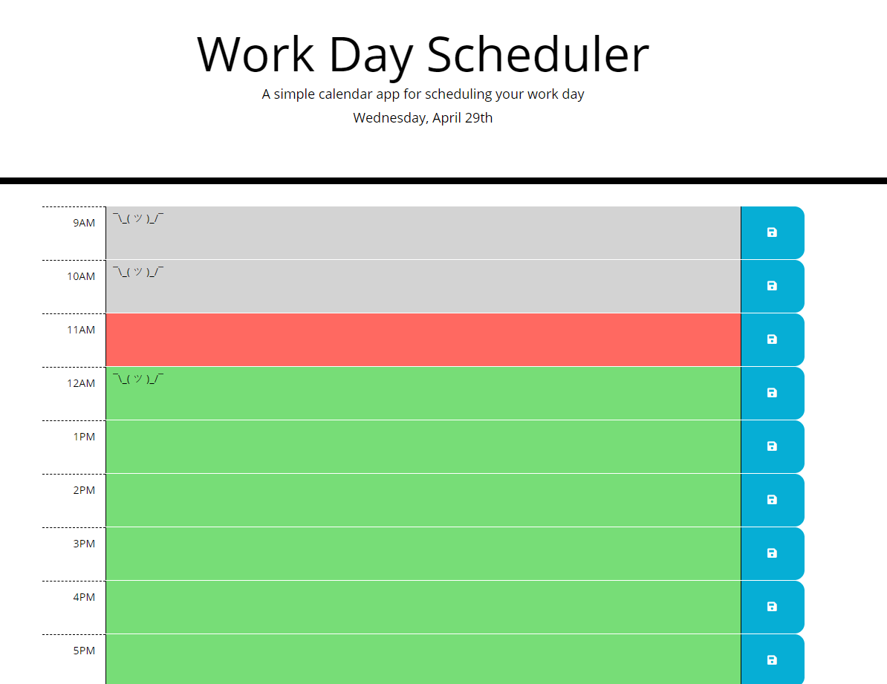

# day-planner

A day planner application, built for the UC Irvine Coding Boot Camp to gain experience with jQuery and Moment.js. The JavaScript is 100% mine (except of course for Moment and jQuery); the HTML and CSS are 100% not mine, unless changes are made in the JS file.

Application deployed at: https://maximilliancharlemagne.github.io/day-planner/

